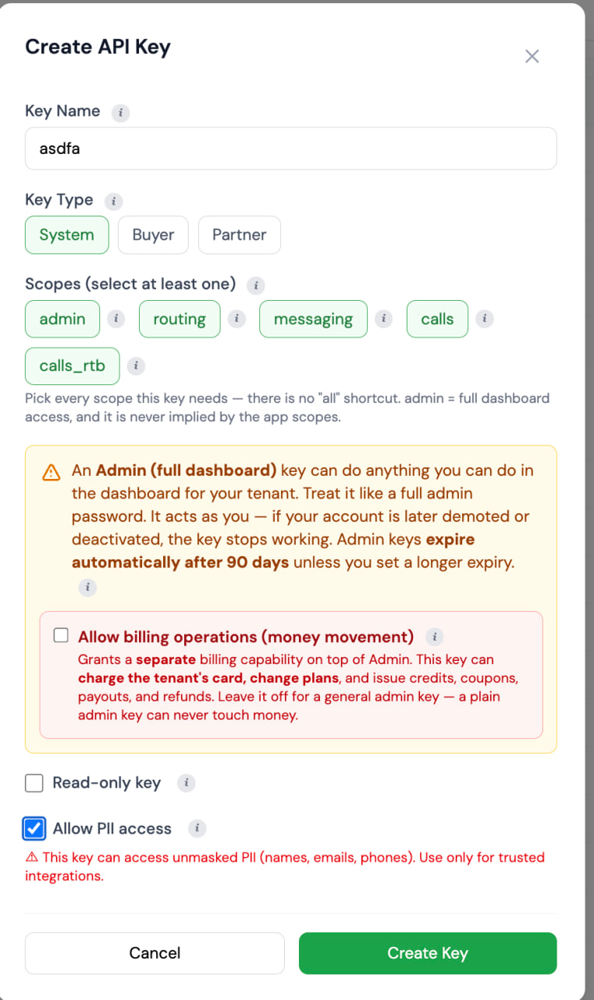

# Welcome to The Lead Router 👋

This is your getting-started kit for [**The Lead Router**](https://theleadrouter.com) — everything you need to set up a personal AI assistant that knows the platform inside and out and can work with your account for you.

You don't need to be technical. There are four steps, and each one is spelled out below. When you're done, you'll be able to ask your assistant things like *"How many leads came in yesterday, and where did they go?"* or *"Walk me through setting up a new campaign"* — and it will know how to answer, because this kit contains the full [user manual](docs/user-manual.md) and the complete API reference for [theleadrouter.com](https://theleadrouter.com).

> **Prefer a printable version?** The same guide is in this folder as a PDF: [`getting-started.pdf`](getting-started.pdf)

---

## What you'll do

| Step | What | Time |
|---|---|---|
| 1 | Get your API key from [The Lead Router](https://theleadrouter.com) | ~2 min |
| 2 | Install **Orca** (the app your assistant lives in) | ~5 min |
| 3 | Open **this project** inside Orca | ~2 min |
| 4 | Give your assistant the API key | ~1 min |

---

## Step 1 — Get your API key

Your API key is what lets your assistant securely act on your Lead Router account. It's like a password, so treat it like one.

**This has to be a System key.** A Partner key, a Buyer key, or a campaign posting key will not work — those are the keys people have used by mistake.

1. Log in to your dashboard at **[theleadrouter.com](https://theleadrouter.com)**.
2. In the left sidebar, go to **System → API Keys**. This is **not** Settings, and it is **not** the API Keys tab on a partner or buyer.
3. Click **Create API Key**. The form looks like this:

   <p align="left">
     
   </p>

4. Match the screenshot:
   - **Key Name** — anything you'll recognize, for example **"Orca assistant"** (the name in the picture is just an example)
   - **Key Type** — **System**. Leave Buyer and Partner unselected.
   - **Scopes** — select **admin**, plus **routing**, **messaging**, **calls**, and **calls_rtb** if those pills are shown. There is no "all" shortcut.
   - Leave **Allow billing operations** unchecked
   - Leave **Read-only key** unchecked
   - **Allow PII access** can stay on if you want the assistant to see real names, emails, and phones
5. Click **Create Key**.
6. **Copy the key immediately and paste it somewhere safe** (a note, a password manager). The full key is shown **only once** — if you lose it, you'll just create a new one, no harm done.

Your key will look like `lr_` followed by a long string of letters and numbers. If it starts with `pk_`, that is a posting key — go back and mint a System key instead.

**Good to know:**

- 🔒 **This key can never move money.** Billing operations (credits, charges, subscriptions) require a separate special key that you are *not* creating here. Your assistant will be able to help run your account, but it is structurally incapable of touching billing.
- ⏳ **The key expires automatically after 90 days.** That's a safety feature. When it expires, just repeat this step to make a new one.
- 🗑️ **You can revoke it any time** from the same **System → API Keys** page, and it stops working immediately.

---

## Step 2 — Install Orca

Orca is the desktop app where your AI assistant lives. It works on Mac, Windows, and Linux.

1. Go to **[onorca.dev](https://www.onorca.dev/)** and click the download button for your computer (on a Mac, pick **Apple Silicon** for newer Macs or **Intel** for older ones — if you're not sure, your Mac is probably Apple Silicon).
2. Open the downloaded file and install it like any other app.
3. Open Orca and sign in.
4. Orca works with an AI assistant subscription you bring — for example **Claude**. If you already have one, connect it when Orca asks. If you don't have one yet, [claude.com](https://claude.com) is where to get a Claude subscription.

---

## Step 3 — Open this project inside Orca

This very page lives in a project folder that contains the user manual and API reference your assistant will read. You just need to open it in Orca.

1. In Orca, look for **Projects** and choose the option to **add / open a project from GitHub**.
2. Paste in this project's address:

   ```
   https://github.com/iscale-llc/theleadrouter.com-onboarding
   ```

3. Orca will download the project and show it in your Projects list.

*Can't find the GitHub option?* You can also click the green **Code** button at the top of this page, choose **Download ZIP**, unzip it, and open that folder in Orca.

---

## Step 4 — Give your assistant the API key

Last step: put the key you copied in Step 1 where your assistant can find it.

1. In the project you just opened, find the file named **`.env.example`**.
2. Make a copy of it and name the copy **`.env`** (just `.env`, nothing before the dot). Your assistant can do this for you — just ask: *"copy .env.example to .env"*.
3. Open `.env` and paste your key after the equals sign, so it looks like:

   ```
   LEADROUTER_API_KEY=lr_your_key_here
   ```

4. Save the file. Done!

The project is set up so the `.env` file **stays private on your computer** — it is never uploaded or shared, even if the project syncs with GitHub.

---

## You're ready — try asking

Start a new assistant session in Orca inside this project and try:

- *"Introduce yourself — what can you help me with on The Lead Router?"*
- *"How many leads came in this week, and how many were sold?"*
- *"Explain how offers, campaigns, and contracts fit together."*
- *"Walk me through adding a new buyer, step by step."*
- *"Show me my active campaigns."*

Your assistant reads the [full user manual](docs/user-manual.md) and the [complete API reference](api/openapi-full.yaml) in this project, and uses your API key to look things up in your live account at [theleadrouter.com](https://theleadrouter.com).

---

## What's in this project

| File | What it is |
|---|---|
| [`README.md`](README.md) | This guide |
| [`getting-started.pdf`](getting-started.pdf) | The same guide as a printable PDF |
| [`docs/create-api-key.png`](docs/create-api-key.png) | Screenshot of the Create API Key form (Step 1) |
| [`docs/user-manual.md`](docs/user-manual.md) | The complete Lead Router user manual — every page, setting, and workflow |
| [`api/openapi-full.yaml`](api/openapi-full.yaml) | The complete API reference (machine-readable — this is what your assistant uses) |
| [`AGENTS.md`](AGENTS.md) | Instructions your assistant reads automatically (how to use the key safely, when to ask before changing things) |
| `.env.example` | The template for your private key file (Step 4) |

---

## A few safety notes

- **Never share your API key** — not in email, not in chat, not in screenshots. Anyone with the key can act as you (except on billing, which is blocked).
- **Your assistant is told to ask before changing anything important.** It will confirm with you before deleting things or making changes that are hard to undo.
- If anything ever feels off, **revoke the key** at [theleadrouter.com](https://theleadrouter.com) under **System → API Keys** — takes effect instantly — and mint a fresh one.

---

## Need help?

Log in to [**theleadrouter.com**](https://theleadrouter.com) and check the built-in **Help** section, or reach out to your Lead Router contact. We're happy to walk you through any of this.
